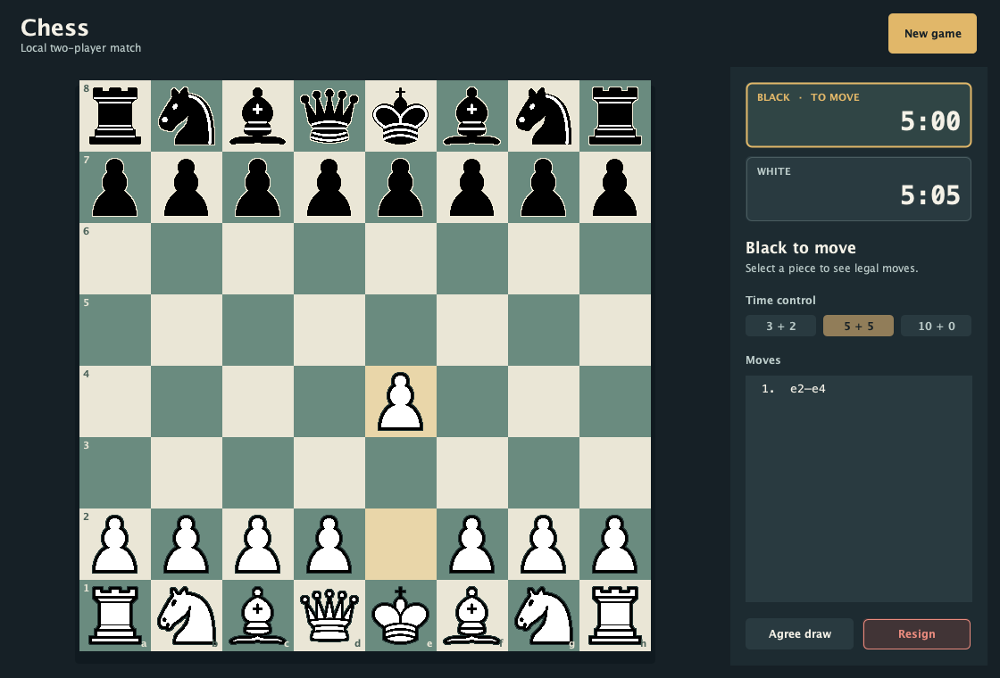

# Chess Game

A local two-player chess game built with Java Swing. The board shows legal moves, checks, move history, and a clock for each player.



## Run

Install JDK 17 or newer. On macOS or Linux, run:

```sh
./run.sh
```

The script creates `dist/ChessGame.jar`. You can launch the built game later with `java -jar dist/ChessGame.jar`.

To run the headless chess-rule tests:

```sh
./test.sh
```

## Play

Choose a clock preset, then click a piece and a highlighted destination. White moves first. When a pawn reaches the far rank, choose its promotion piece. The presets show minutes plus seconds added after each move. Use **New game** to reset the board and clocks; **Agree draw** and **Resign** end the current game. A player loses when their clock runs out.

You can also use the arrow keys to focus a square, Enter or Space to select it, and Escape to clear the selection.

The rules engine handles legal moves, check, checkmate, stalemate, castling, en passant, promotion, and common insufficient-material draws. This is a same-computer game; it does not include a computer opponent or online play.

Draws by repetition and the fifty-move rule are not yet detected automatically.

## Project structure

- `ChessGame.java`: chess state and rules, independent of Swing.
- `ChessApp.java`: desktop interface, clocks, board rendering, and controls.
- `ChessGameTest.java`: headless rule checks.
- `W*.png` and `B*.png`: piece artwork from the original project. The knight files retain their original `night` spelling.

The earlier prototype files were replaced by the standalone rules engine and interface. The project has no external dependencies.
